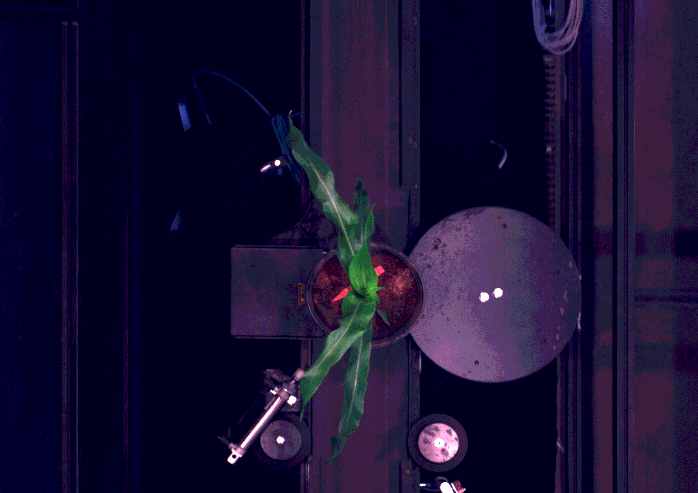

# Crop Hyperspectral Image Processing Python 
 The Python version for processing .raw and .hdr hyperspectral images for crops. Source code for Hyperspectral image processing, a paper titled "Removal of greenhouse microclimate heterogeneity with conveyor system for indoor phenotyping"

 | 

# Contents
* Source code for processing HSI images (/code)
* Raw HSI samples (/HSIData)
* Raw whitereference (/HSIData/white)
* Processed image samples including rgb and binary for visualization (/ProcessedData/sample)
* Processed data table (.csv) for each image including spectral and morphorlogical features (/ProcessedData)

# Requirements
* Ubuntu / macOS / Windows
* Python3
* PyTorch 0.4.0 and above
* Scikit-Learn and Scikit-Image

# Usage
* clone this repository
> git clone https://github.com/wasmdxl1990/Crop-Hyperspectral-Image-Processing-Python-.git

* go to the code folder and setup the input path, output path and threshold
> Ususally threshold =7 works well on all my HSI images for plant segmentation.

* run main script 
> python main.py

* result has been saved in the output path
> open the /ProcessedData
 
